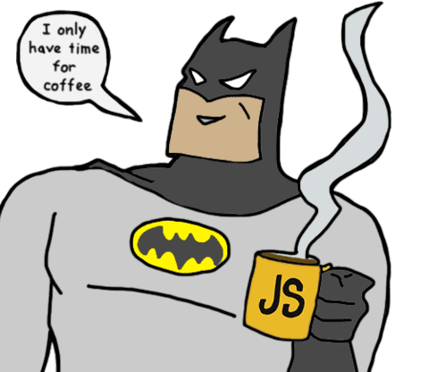

## Hello, World! 👋 I'm Ilya, a self-motivated web developer who loves JavaScript 😍

### Check out my resume:

<a href="https://disk.yandex.ru/i/7e5pf0Wt9k8-Xg" aria-label="Download from Yandex Drive">
  <picture>
    <source srcset="./assets/dark/yandex-drive.svg" media="(prefers-color-scheme: dark)" />
    
  </picture>
</a>
<a href="https://drive.google.com/file/d/1PWmD7lq_-U3E-9Zq90rCmgGJoK7YILs-/view?usp=drive_link" aria-label="Download from Google Drive">
  <picture>
    <source srcset="./assets/dark/google-drive.svg" media="(prefers-color-scheme: dark)" />
    
  </picture>
</a>

### I code with:

    

                    
    

### My stats:

<picture >
  <source
    srcset="https://github-readme-stats.vercel.app/api/top-langs?username=Filil2003&theme=github_dark&hide_border=true&disable_animations=true&card_width=320"
    media="(prefers-color-scheme: dark)"
  />
  
</picture>

<picture>
  <source
    srcset="https://github-readme-stats.vercel.app/api/wakatime?username=Filil2003&theme=github_dark&hide_border=true&langs_count=8&disable_animations=true&hide_progress=true"
    media="(prefers-color-scheme: dark)"
  />
  
</picture>
