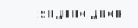
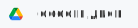

## Hello, World! 👋 I'm Ilya, a self-motivated web developer who loves JavaScript 😍

### I code with:

    

                    
    

### My Stats:

<picture >
  <source
    srcset="https://github-readme-stats.vercel.app/api/top-langs?username=Filil2003&theme=github_dark&hide_border=true&disable_animations=true&card_width=320"
    media="(prefers-color-scheme: dark)"
  />
  <source
    srcset="https://github-readme-stats.vercel.app/api/top-langs?username=Filil2003&theme=default&hide_border=true&disable_animations=true&card_width=320"
    media="(prefers-color-scheme: light), (prefers-color-scheme: no-preference)"
  />
  
</picture>

<picture>
  <source
    srcset="https://github-readme-stats.vercel.app/api/wakatime?username=Filil2003&theme=github_dark&hide_border=true&langs_count=8&disable_animations=true&hide_progress=true"
    media="(prefers-color-scheme: dark)"
  />
  <source
    srcset="https://github-readme-stats.vercel.app/api/wakatime?username=Filil2003&theme=default&hide_border=true&langs_count=8&disable_animations=true&hide_progress=true"
    media="(prefers-color-scheme: light), (prefers-color-scheme: no-preference)"
  />
  
</picture>

### My CVs:

<a href="https://disk.yandex.ru/i/7e5pf0Wt9k8-Xg" target="_blank">
<picture >
  <source
    srcset="./assets/yandex-drive-dark.svg"
    media="(prefers-color-scheme: dark)"
  />
  
</picture>
</a>

<a href="https://drive.google.com/file/d/1PWmD7lq_-U3E-9Zq90rCmgGJoK7YILs-/view?usp=drive_link" target="_blank">
<picture >
  <source
    srcset="./assets/google-drive-dark.svg"
    media="(prefers-color-scheme: dark)"
  />
  
</picture>
</a>
